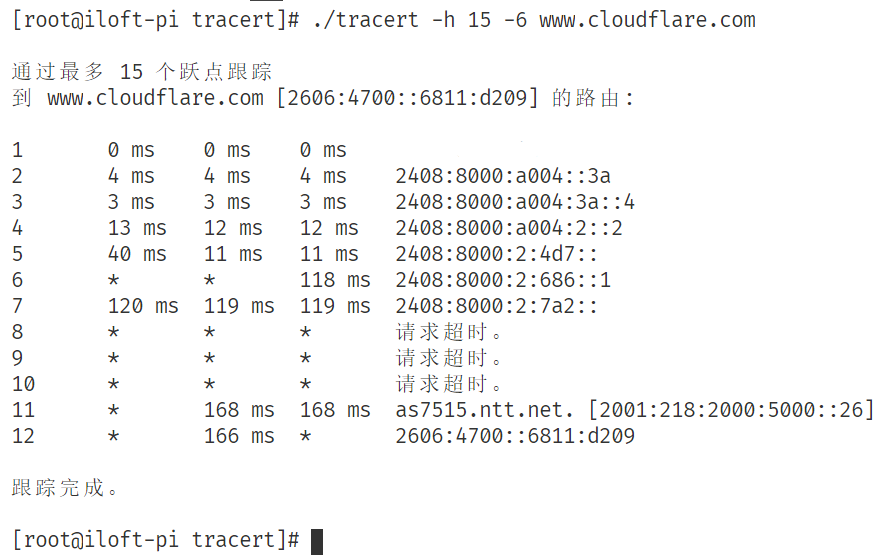

# go-tracert
课程项目使用 golang 实现的 Tracert 工具

## 说明
主要功能
- IPv4 Tracert
- IPv6 Tracert
- Reverse DNS Lookup

主要使用了以下库：
- net
- golang.org/x/net/icmp
- golang.org/x/net/ipv4
- golang.org/x/net/ipv6

由于使用了 `net.ListenPacket()` 因此不能在 Windows 下运行，且需要 root 权限。

## 使用示例
### 编译
```
go build
```
### 帮助
```
sudo ./tracert
```
### 路由追踪
#### 默认
```
sudo ./tracert www.cloudflare.com
```
#### 强制使用 IPv4
```
sudo ./tracert -4 www.cloudflare.com
```
#### 强制使用 IPv6
```
sudo ./tracert -6 www.cloudflare.com
```
#### 指定最大跃点数
```
sudo ./tracert -h 10 www.cloudflare.com
```

